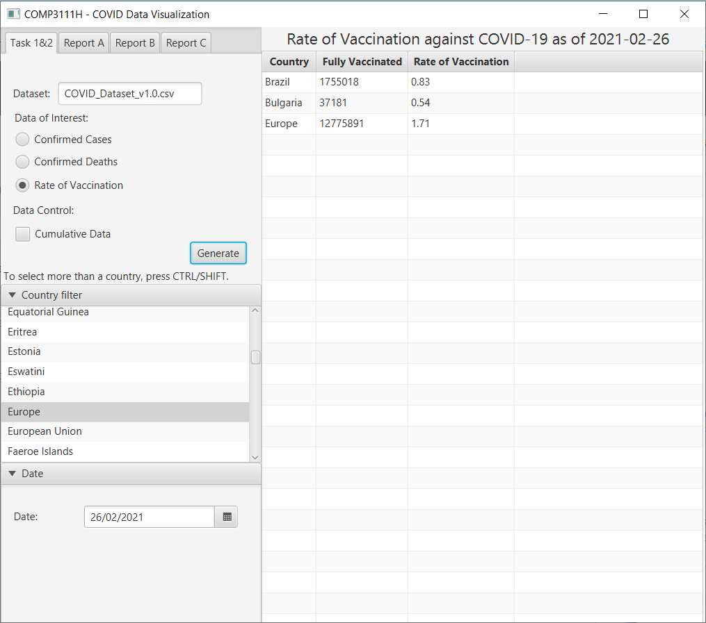
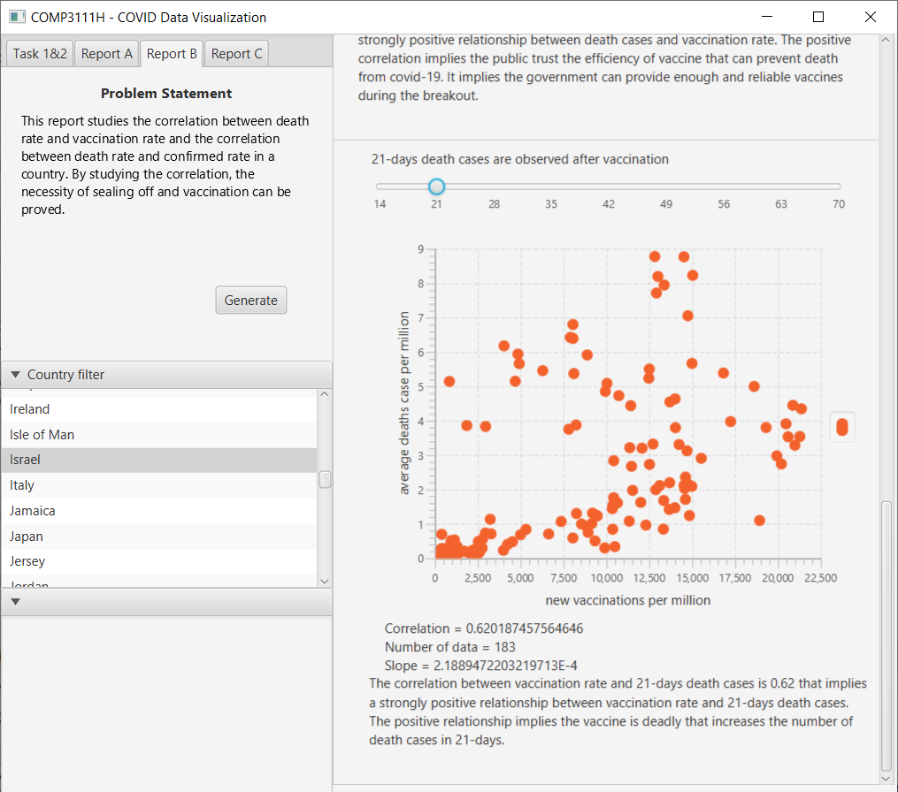

# T-15

https://github.com/kkdlau/COMP3111H-T15-Team-Repo.git

## Team Formation

#### 1. Lau, Ka Kit Danny

* General Information:

  | Email | Github | Dev Branch |
  | -------- | -------- | -------- |
  | kkdlau     | kkdlau     |` commonFeatures` ` kkdlau/Task-A/*`|

* Assigned tasks: A1, A2, A3

#### 2. Leung, Wing Chung

* General Information:

  | Email | Github | Dev Branch |
  | -------- | -------- | -------- |
  | wcleungaj     | RickyHKUST     |` commonFeatures`  ` wcleungaj/Task-B/*`|

* Assigned tasks: B1, B2, B3  

#### 3. Toh, Magdalene Youjun  

* General Information:  

  | Email | GitHub | Dev Branch |  
  | -------- |  -------- | -------- |  
  | ymt      | TohYJ     |` commonFeatures` ` magd/Task-C/*`|

* Assigned tasks: C1, C2, C3

## Code Documentation [Javadoc]

https://kkdlau.github.io/COMP3111H-T15-Team-Repo/  

## Screenshots of application  

#### Table and Chart Generating Tasks   
| Task A1 | Task A2 |  
| -------- | -------- |  
| |   |  

| Task B1 | Task B2 |  
| -------- | -------- |  
| |   |   

| Task C1 | Task C2 |  
| -------- | -------- |  
| |   | 

#### Report Generating Tasks  
Task A3  
   

Task B3  
  

Task C3  
   

## Testing Reports  
#### Unit testing  
 
  

#### Coverage test  

  

## Supplementary Video  
https://drive.google.com/file/d/1fZQy24GhBx98omUwLN2bWApBD6Q5u5M8/view  